# schema.md

## 1. 版本说明

本文档基于《企业排班系统 PRD（最终版）》输出，覆盖：

- 账号与权限
- 字典管理
- 场景 / 项目 / 任务 / 设备
- 部门 / 渠道 / 员工 / 技能
- 用工规则
- 排班模板 / 排班版本 / 排班记录
- Excel 导入批次
- 调班申请
- 工时画像
- 公告管理

> 本版为 **完整关联关系版**：\
> 除字段设计外，还补充了完整的外键映射、唯一约束、检查约束、索引建议、跨表规则说明。\
> 仍然遵循你的要求：**每个表只输出单独的** **`erDiagram`**。

***

## 2. 统一设计约定

### 2.1 命名规范

- 表名：单数、`snake_case`
- 主键：统一 `id`
- 外键：统一 `<table_name>_id`
- 字典项外键：统一 `*_dict_item_id`
- 布尔字段：统一 `is_*`
- 名称字段：统一 `*_name`
- 编码字段：统一 `*_code`
- 备注字段：统一 `remark`
- 描述字段：统一 `description`

### 2.2 主键与通用字段

所有表默认包含以下通用字段：

| 字段名         | 类型          | 说明   |
| ----------- | ----------- | ---- |
| id          | uuid        | 主键   |
| created\_at | timestamptz | 创建时间 |
| updated\_at | timestamptz | 更新时间 |

### 2.3 主键策略

适配 Supabase / PostgreSQL，统一使用：

- `uuid` 主键
- 后续 SQL 可使用 `gen_random_uuid()` 作为默认值

### 2.4 删除策略建议

本系统主数据建议采用：

- **停用 / 状态变更代替物理删除**
- `scene / department / channel / employee / skill / project / task / device` 等核心主数据表 **不建议物理删除**
- 关联表如 `role_permission / user_role / task_device` 可根据业务选择级联删除

***

## 3. 字典体系设计

### 3.1 字典类型初始化建议

| type\_code         | 说明   |
| ------------------ | ---- |
| channel\_type      | 渠道类型 |
| shift\_type        | 班次类型 |
| publish\_status    | 发布状态 |
| approval\_status   | 审批状态 |
| employee\_status   | 员工状态 |
| project\_status    | 项目状态 |
| task\_status       | 任务状态 |
| device\_status     | 设备状态 |
| announcement\_type | 公告类型 |
| schedule\_code     | 排班编码 |

### 3.2 字典扩展配置建议

#### 3.2.1 `shift_type.extra_config`

```json
{
  "start_time": "09:00",
  "end_time": "18:00",
  "planned_hours": 8,
  "count_as_hours": true,
  "color": "#3B82F6"
}
```

#### 3.2.2 `schedule_code.extra_config`

```json
{
  "excel_code": "捕1",
  "aliases": ["捕 1", "作业1"],
  "category": "work",
  "count_as_hours": true,
  "standard_hours": 8,
  "related_shift_type_item_code": "day_shift",
  "color": "#10B981",
  "allow_empty_task": true,
  "allow_empty_device": true
}
```

### 3.3 字典引用映射表

> 以下约束无法仅靠普通外键保证，需要通过应用层或 trigger 校验：\
> `*_dict_item_id` 对应的字典项必须属于正确的 `dict_type.type_code`

| 业务字段                                                          | 目标字典类型              |
| ------------------------------------------------------------- | ------------------- |
| channel.channel\_type\_dict\_item\_id                         | `channel_type`      |
| employee.employee\_status\_dict\_item\_id                     | `employee_status`   |
| project.project\_status\_dict\_item\_id                       | `project_status`    |
| task.task\_status\_dict\_item\_id                             | `task_status`       |
| device.device\_status\_dict\_item\_id                         | `device_status`     |
| schedule\_version.publish\_status\_dict\_item\_id             | `publish_status`    |
| schedule.shift\_type\_dict\_item\_id                          | `shift_type`        |
| schedule.schedule\_code\_dict\_item\_id                       | `schedule_code`     |
| shift\_change\_request.approval\_status\_dict\_item\_id       | `approval_status`   |
| shift\_change\_request.target\_shift\_type\_dict\_item\_id    | `shift_type`        |
| shift\_change\_request.target\_schedule\_code\_dict\_item\_id | `schedule_code`     |
| announcement.announcement\_type\_dict\_item\_id               | `announcement_type` |

***

## 4. 外键关系总览

> 这里不画总图，只用文字展开完整关系。

| 子表字段                                                          | 关联到                        | 删除建议     | 说明          |
| ------------------------------------------------------------- | -------------------------- | -------- | ----------- |
| user\_account.employee\_id                                    | employee.id                | SET NULL | 账号可不绑定员工    |
| role\_permission.role\_id                                     | role.id                    | CASCADE  | 角色删掉时关联清理   |
| role\_permission.permission\_id                               | permission.id              | CASCADE  | 权限删掉时关联清理   |
| user\_role.user\_account\_id                                  | user\_account.id           | CASCADE  | 用户删掉时关联清理   |
| user\_role.role\_id                                           | role.id                    | CASCADE  | 角色删掉时关联清理   |
| dict\_item.dict\_type\_id                                     | dict\_type.id              | RESTRICT | 字典类型不建议物理删除 |
| department.manager\_employee\_id                              | employee.id                | SET NULL | 部门负责人可为空    |
| channel.channel\_type\_dict\_item\_id                         | dict\_item.id              | RESTRICT | 渠道类型字典项     |
| employee.channel\_id                                          | channel.id                 | RESTRICT | 员工所属渠道      |
| employee.department\_id                                       | department.id              | RESTRICT | 员工所属部门      |
| employee.employee\_status\_dict\_item\_id                     | dict\_item.id              | RESTRICT | 员工状态        |
| employee\_skill.employee\_id                                  | employee.id                | CASCADE  | 员工删掉时技能关联清理 |
| employee\_skill.skill\_id                                     | skill.id                   | RESTRICT | 技能不建议物理删除   |
| project.scene\_id                                             | scene.id                   | RESTRICT | 项目必须关联场景    |
| project.owner\_employee\_id                                   | employee.id                | SET NULL | 项目负责人可为空    |
| project.project\_status\_dict\_item\_id                       | dict\_item.id              | RESTRICT | 项目状态        |
| task.project\_id                                              | project.id                 | RESTRICT | 任务必须归属项目    |
| task.task\_status\_dict\_item\_id                             | dict\_item.id              | RESTRICT | 任务状态        |
| device.scene\_id                                              | scene.id                   | RESTRICT | 设备必须归属场景    |
| device.skill\_id                                              | skill.id                   | RESTRICT | 设备必须绑定技能    |
| device.device\_status\_dict\_item\_id                         | dict\_item.id              | RESTRICT | 设备状态        |
| task\_device.task\_id                                         | task.id                    | CASCADE  | 任务删掉时绑定清理   |
| task\_device.device\_id                                       | device.id                  | RESTRICT | 设备不建议物理删除   |
| shift\_template.applicable\_task\_id                          | task.id                    | SET NULL | 模板可独立存在     |
| shift\_template.applicable\_department\_id                    | department.id              | SET NULL | 模板可独立存在     |
| schedule\_version.project\_id                                 | project.id                 | RESTRICT | 版本归属项目      |
| schedule\_version.publish\_status\_dict\_item\_id             | dict\_item.id              | RESTRICT | 发布状态        |
| schedule\_version.created\_by\_user\_account\_id              | user\_account.id           | RESTRICT | 创建人         |
| schedule\_version.published\_by\_user\_account\_id            | user\_account.id           | SET NULL | 发布人         |
| schedule.project\_id                                          | project.id                 | RESTRICT | 排班所属项目      |
| schedule.schedule\_version\_id                                | schedule\_version.id       | CASCADE  | 版本删掉时明细清理   |
| schedule.employee\_id                                         | employee.id                | RESTRICT | 排班员工        |
| schedule.department\_id                                       | department.id              | RESTRICT | 部门快照引用      |
| schedule.task\_id                                             | task.id                    | RESTRICT | 任务可为空       |
| schedule.device\_id                                           | device.id                  | RESTRICT | 设备可为空       |
| schedule.shift\_type\_dict\_item\_id                          | dict\_item.id              | RESTRICT | 班次类型        |
| schedule.schedule\_code\_dict\_item\_id                       | dict\_item.id              | RESTRICT | 排班编码        |
| schedule.skill\_id\_snapshot                                  | skill.id                   | RESTRICT | 技能快照        |
| schedule.schedule\_import\_batch\_id                          | schedule\_import\_batch.id | SET NULL | 导入批次可为空     |
| shift\_change\_request.applicant\_employee\_id                | employee.id                | RESTRICT | 申请人         |
| shift\_change\_request.target\_employee\_id                   | employee.id                | SET NULL | 目标员工可为空     |
| shift\_change\_request.original\_schedule\_id                 | schedule.id                | RESTRICT | 原排班         |
| shift\_change\_request.target\_schedule\_id                   | schedule.id                | SET NULL | 互换目标排班      |
| shift\_change\_request.target\_shift\_type\_dict\_item\_id    | dict\_item.id              | RESTRICT | 目标班次类型      |
| shift\_change\_request.target\_schedule\_code\_dict\_item\_id | dict\_item.id              | RESTRICT | 目标排班编码      |
| shift\_change\_request.target\_task\_id                       | task.id                    | SET NULL | 目标任务可为空     |
| shift\_change\_request.target\_device\_id                     | device.id                  | SET NULL | 目标设备可为空     |
| shift\_change\_request.approval\_status\_dict\_item\_id       | dict\_item.id              | RESTRICT | 审批状态        |
| shift\_change\_request.approver\_user\_account\_id            | user\_account.id           | SET NULL | 审批人         |
| schedule\_import\_batch.project\_id                           | project.id                 | RESTRICT | 导入项目        |
| schedule\_import\_batch.schedule\_version\_id                 | schedule\_version.id       | SET NULL | 失败时可为空      |
| schedule\_import\_batch.imported\_by\_user\_account\_id       | user\_account.id           | RESTRICT | 导入人         |
| employee\_work\_metric.employee\_id                           | employee.id                | CASCADE  | 员工删掉时画像可清理  |
| announcement.announcement\_type\_dict\_item\_id               | dict\_item.id              | RESTRICT | 公告类型        |
| announcement.published\_by\_user\_account\_id                 | user\_account.id           | RESTRICT | 发布人         |

***

## 5. 全局唯一约束建议

| 约束                                                                                                             | 说明            |
| -------------------------------------------------------------------------------------------------------------- | ------------- |
| `user_account.username` 唯一（非空）                                                                                 | Web 账号唯一      |
| `user_account.employee_id` 唯一（非空）                                                                              | 一个员工最多绑定一个账号  |
| `user_account.wechat_openid` 唯一（非空）                                                                            | 微信登录唯一        |
| `role.role_code` 唯一                                                                                            | 角色编码唯一        |
| `permission.permission_code` 唯一                                                                                | 权限编码唯一        |
| `permission(platform_code, module_code, action_code)` 唯一                                                       | 权限动作组合唯一      |
| `role_permission(role_id, permission_id)` 唯一                                                                   | 防重复授权         |
| `user_role(user_account_id, role_id)` 唯一                                                                       | 防重复绑定角色       |
| `dict_type.type_code` 唯一                                                                                       | 字典类型唯一        |
| `dict_item(dict_type_id, item_code)` 唯一                                                                        | 同类型下字典编码唯一    |
| `scene.scene_code` 唯一（非空）                                                                                      | 场景编码唯一        |
| `department.department_code` 唯一（非空）                                                                            | 部门编码唯一        |
| `channel.channel_code` 唯一（非空）                                                                                  | 渠道编码唯一        |
| `employee.employee_no` 唯一                                                                                      | 工号唯一          |
| `employee(mobile_number, channel_id)` 唯一                                                                       | 同渠道下手机号唯一     |
| `skill.skill_code` 唯一                                                                                          | 技能编码唯一        |
| `employee_skill(employee_id, skill_id)` 唯一                                                                     | 员工技能唯一        |
| `employee_skill(employee_id) WHERE is_primary = true AND is_enabled = true` 唯一                                 | 建议保证仅一个主技能    |
| `project.project_code` 唯一（非空）                                                                                  | 项目编码唯一        |
| `task(project_id, task_code)` 唯一（task\_code 非空）                                                                | 项目内任务编码唯一     |
| `device.device_code` 唯一                                                                                        | 设备编号唯一        |
| `task_device(task_id, device_id)` 唯一                                                                           | 防重复绑定设备       |
| `schedule_version(project_id, schedule_month, version_no)` 唯一                                                  | 项目月份版本唯一      |
| `schedule(schedule_version_id, employee_id, schedule_date)` 唯一                                                 | 单人单日单版本唯一     |
| `schedule(schedule_version_id, device_id, schedule_date, shift_type_dict_item_id)` 唯一（`device_id IS NOT NULL`） | 同设备同日同班次单版本唯一 |
| `employee_work_metric.employee_id` 唯一                                                                          | 一个员工一条当前画像    |

***

## 6. 全局检查约束建议

| 约束                                                                                                                          | 说明            |
| --------------------------------------------------------------------------------------------------------------------------- | ------------- |
| `employee_skill.skill_level IN (1,2,3)`                                                                                     | 技能级别固定三档      |
| `schedule.skill_level_snapshot IN (1,2,3) OR schedule.skill_level_snapshot IS NULL`                                         | 快照级别约束        |
| `project.project_mode IN ('self_built', 'non_intrusive')`                                                                   | 项目模式固定值       |
| `schedule_version.generation_type IN ('manual', 'template', 'excel')`                                                       | 版本生成方式固定值     |
| `schedule.source_type IN ('manual', 'template', 'excel')`                                                                   | 排班来源固定值       |
| `shift_change_request.request_type IN ('swap', 'direct_change')`                                                            | 调班类型固定值       |
| `schedule_import_batch.import_mode IN ('cover_draft', 'new_version')`                                                       | 导入模式固定值       |
| `schedule_import_batch.processing_status IN ('pending', 'success', 'failed')`                                               | 导入处理状态固定值     |
| `user_account.account_source IN ('web', 'wechat', 'mixed')`                                                                 | 账号来源固定值       |
| `user_account.account_status IN ('active', 'inactive', 'locked')`                                                           | 账号状态固定值       |
| `announcement.visibility_scope_type IN ('all', 'role', 'department', 'custom')`                                             | 公告范围类型固定值     |
| `schedule_version.schedule_month = date_trunc('month', schedule_version.schedule_month)::date`                              | 月份字段必须存当月 1 号 |
| `schedule_import_batch.schedule_month = date_trunc('month', schedule_import_batch.schedule_month)::date`                    | 导入月份必须存当月 1 号 |
| `project.start_date <= project.end_date`                                                                                    | 项目时间合法        |
| `task.planned_start_date <= task.planned_end_date`                                                                          | 任务时间合法        |
| `employee_skill.efficiency_coefficient > 0`                                                                                 | 效率系数需大于 0     |
| `schedule.planned_hours >= 0`                                                                                               | 排班工时不能为负数     |
| `schedule.task_id IS NOT NULL OR schedule.device_id IS NULL`                                                                | 选设备时必须有任务     |
| `task.target_total_hours >= 0`                                                                                              | 任务目标工时非负      |
| `task.hours_per_shift >= 0`                                                                                                 | 单次工时非负        |
| `task.target_efficiency_rate BETWEEN 0 AND 1`（建议）                                                                           | 有效率要求         |
| `labor_rule.daily_hours_limit >= 0`                                                                                         | 日工时非负         |
| `labor_rule.weekly_hours_limit >= 0`                                                                                        | 周工时非负         |
| `labor_rule.max_consecutive_work_days >= 0`                                                                                 | 连续工作天数非负      |
| `schedule_import_batch.total_row_count >= 0`                                                                                | 行数非负          |
| `schedule_import_batch.success_row_count >= 0`                                                                              | 行数非负          |
| `schedule_import_batch.failed_row_count >= 0`                                                                               | 行数非负          |
| `schedule_import_batch.success_row_count + schedule_import_batch.failed_row_count <= schedule_import_batch.total_row_count` | 行数闭环          |
| `employee_work_metric.* >= 0`                                                                                               | 画像指标不能为负      |

***

## 7. 索引设计建议

### 7.1 通用规则

- **所有外键字段默认建立普通 B-Tree 索引**
- 所有唯一约束自动形成唯一索引
- 高频查询字段优先建立组合索引

### 7.2 关键业务索引

| 表                       | 索引建议                                                                | 用途          |
| ----------------------- | ------------------------------------------------------------------- | ----------- |
| dict\_item              | `(dict_type_id, is_enabled, sort_order)`                            | 字典项列表查询     |
| employee                | `(department_id, employee_status_dict_item_id)`                     | 按部门筛选员工     |
| employee                | `(channel_id, employee_status_dict_item_id)`                        | 按渠道筛选员工     |
| employee                | `(full_name)`                                                       | Excel 按姓名匹配 |
| employee\_skill         | `(skill_id, is_enabled)`                                            | 按技能筛选员工     |
| project                 | `(scene_id, project_status_dict_item_id)`                           | 场景下项目查询     |
| task                    | `(project_id, task_status_dict_item_id)`                            | 项目任务列表      |
| device                  | `(scene_id, device_status_dict_item_id)`                            | 场景设备列表      |
| shift\_template         | `(applicable_task_id, applicable_department_id, is_enabled)`        | 模板筛选        |
| schedule\_version       | `(project_id, schedule_month, publish_status_dict_item_id)`         | 月度版本查询      |
| schedule                | `(employee_id, schedule_date)`                                      | 员工班表查询      |
| schedule                | `(project_id, schedule_date)`                                       | 项目排班查询      |
| schedule                | `(task_id, schedule_date)`                                          | 任务统计        |
| schedule                | `(device_id, schedule_date)`                                        | 设备使用统计      |
| schedule                | `(schedule_version_id, schedule_date)`                              | 版本明细查询      |
| schedule                | `(schedule_import_batch_id)`                                        | 导入追溯        |
| shift\_change\_request  | `(applicant_employee_id, approval_status_dict_item_id, created_at)` | 调班记录查询      |
| shift\_change\_request  | `(target_employee_id, approval_status_dict_item_id)`                | 互换调班查询      |
| schedule\_import\_batch | `(project_id, schedule_month, processing_status, created_at)`       | 导入批次查询      |
| employee\_work\_metric  | `(calculated_at)`                                                   | 统计更新时间排序    |
| announcement            | `(published_at DESC)`                                               | 公告列表        |
| announcement            | `(announcement_type_dict_item_id, published_at DESC)`               | 分类公告        |

***

## 8. 跨表业务规则（建议用应用层 / Trigger 实现）

以下规则**仅靠普通外键和 check 不能完全保证**：

1. **字典项类型校验**
   - 例如 `employee.employee_status_dict_item_id` 必须属于 `employee_status`
   - `schedule.schedule_code_dict_item_id` 必须属于 `schedule_code`
2. **任务设备场景一致性**
   - `task_device.device_id` 必须来自 `task.project_id -> project.scene_id` 对应场景
3. **排班项目一致性**
   - `schedule.project_id` 必须等于 `schedule.schedule_version_id -> schedule_version.project_id`
4. **排班任务项目一致性**
   - `schedule.task_id` 非空时，`task.project_id` 必须等于 `schedule.project_id`
5. **排班设备场景一致性**
   - `schedule.device_id` 非空时，设备必须属于 `schedule.project_id` 关联场景
6. **排班设备必须属于任务**
   - `schedule.device_id` 非空时，必须存在 `task_device(task_id, device_id)`
7. **排班设备技能校验**
   - `schedule.device_id` 非空时，员工必须存在启用中的 `employee_skill(employee_id, device.skill_id)`
8. **排班日期范围校验**
   - `schedule.schedule_date` 应落在项目日期范围内
   - 若 `task_id` 非空，可进一步要求落在任务计划日期范围内
9. **已发布版本不可直接修改**
   - `schedule_version` 状态为已发布时，`schedule` 明细不允许直接改写
   - 只能通过新版本或调班流程处理
10. **Excel 导入姓名唯一匹配**
    - 标准模板按 `employee.full_name` 匹配
    - 若匹配到 0 条或多条，应导入失败
    - 此规则不建议做数据库唯一约束，应在导入逻辑中实现
11. **调班类型字段组合校验**
    - `request_type = swap` 时，应要求 `target_employee_id`、`target_schedule_id`
    - `request_type = direct_change` 时，应要求 `target_date`、`target_shift_type_dict_item_id`、`target_schedule_code_dict_item_id`
12. **排班编码导入完整配置校验**
    - `schedule_code` 字典项必须配置好：
      - 分类
      - 是否计工时
      - 标准工时
      - 映射班次
    - 否则 Excel 导入失败

***

# 9. 数据表设计

> 以下每张表都只输出**单独的** `erDiagram`。

***

## 9.1 `user_account`

**表说明**：系统账号表，支持 Web 管理后台、管理端小程序、员工端小程序登录能力。

### 字段定义

> 省略通用字段：`id / created_at / updated_at`

| 字段名             | 类型           | 必填 | 说明                           |
| --------------- | ------------ | -- | ---------------------------- |
| username        | varchar(50)  | 否  | Web 登录账号，建议唯一                |
| password\_hash  | text         | 否  | 密码哈希                         |
| mobile\_number  | varchar(20)  | 否  | 账号手机号                        |
| employee\_id    | uuid         | 否  | 关联员工                         |
| account\_source | varchar(20)  | 是  | `web / wechat / mixed`       |
| wechat\_openid  | varchar(100) | 否  | 微信 openid，建议唯一               |
| wechat\_unionid | varchar(100) | 否  | 微信 unionid                   |
| account\_status | varchar(20)  | 是  | `active / inactive / locked` |
| last\_login\_at | timestamptz  | 否  | 最后登录时间                       |
| is\_enabled     | boolean      | 是  | 是否启用                         |

### 本表约束

- 唯一：`username`（非空）
- 唯一：`employee_id`（非空）
- 唯一：`wechat_openid`（非空）
- 检查：`account_source IN ('web','wechat','mixed')`
- 检查：`account_status IN ('active','inactive','locked')`

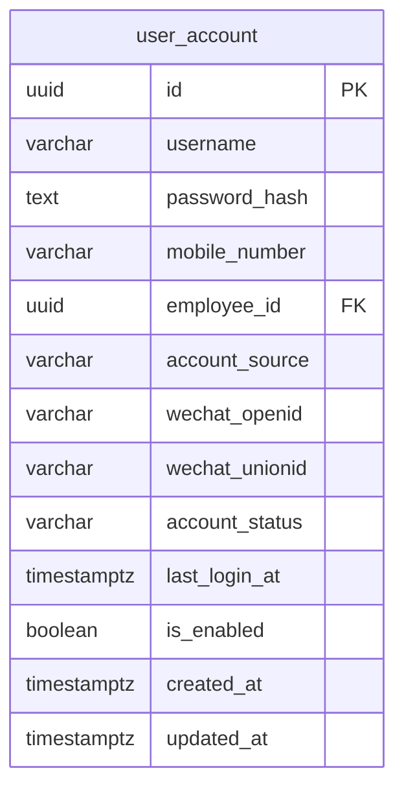
```mermaid
erDiagram
    user_account {
        uuid id PK
        varchar username
        text password_hash
        varchar mobile_number
        uuid employee_id FK
        varchar account_source
        varchar wechat_openid
        varchar wechat_unionid
        varchar account_status
        timestamptz last_login_at
        boolean is_enabled
        timestamptz created_at
        timestamptz updated_at
    }
```

***

## 9.2 `role`

**表说明**：系统角色表。

### 字段定义

| 字段名         | 类型           | 必填 | 说明                           |
| ----------- | ------------ | -- | ---------------------------- |
| role\_code  | varchar(50)  | 是  | 角色编码                         |
| role\_name  | varchar(100) | 是  | 角色名称                         |
| role\_scope | varchar(20)  | 是  | `global / department / self` |
| description | text         | 否  | 角色说明                         |
| sort\_order | int          | 是  | 排序号                          |
| is\_enabled | boolean      | 是  | 是否启用                         |

### 本表约束

- 唯一：`role_code`
- 检查：`role_scope IN ('global','department','self')`

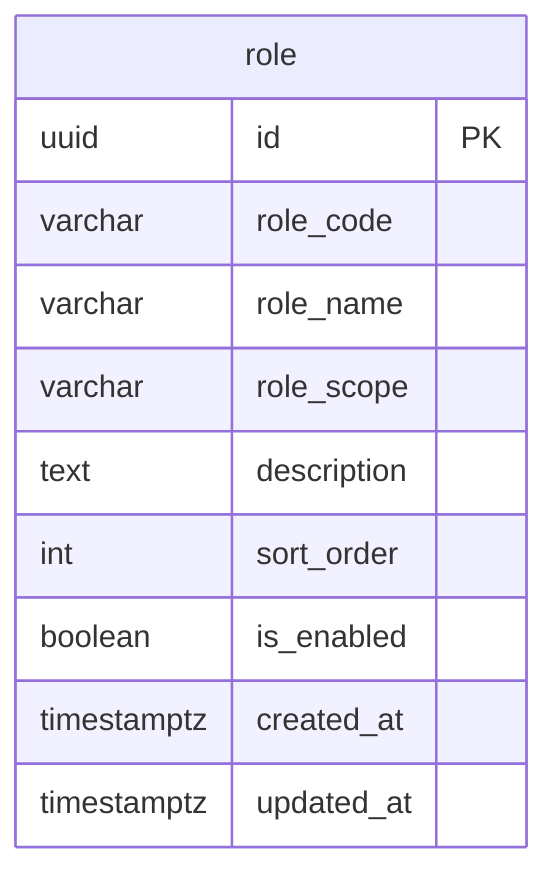
```mermaid
erDiagram
    role {
        uuid id PK
        varchar role_code
        varchar role_name
        varchar role_scope
        text description
        int sort_order
        boolean is_enabled
        timestamptz created_at
        timestamptz updated_at
    }
```

***

## 9.3 `permission`

**表说明**：权限定义表，支持菜单、接口、按钮级权限控制。

### 字段定义

| 字段名              | 类型           | 必填 | 说明                                                  |
| ---------------- | ------------ | -- | --------------------------------------------------- |
| permission\_code | varchar(100) | 是  | 权限编码                                                |
| permission\_name | varchar(100) | 是  | 权限名称                                                |
| platform\_code   | varchar(20)  | 是  | `web / manager_miniapp / employee_miniapp / shared` |
| module\_code     | varchar(50)  | 是  | 模块编码                                                |
| action\_code     | varchar(50)  | 是  | 动作编码                                                |
| description      | text         | 否  | 权限说明                                                |
| sort\_order      | int          | 是  | 排序号                                                 |
| is\_enabled      | boolean      | 是  | 是否启用                                                |

### 本表约束

- 唯一：`permission_code`
- 唯一：`(platform_code, module_code, action_code)`

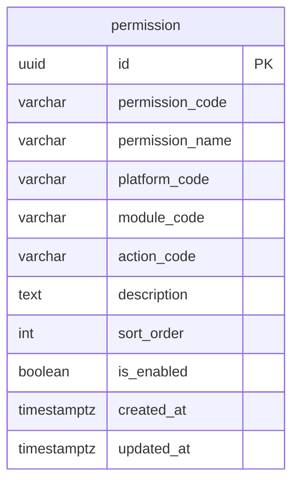
```mermaid
erDiagram
    permission {
        uuid id PK
        varchar permission_code
        varchar permission_name
        varchar platform_code
        varchar module_code
        varchar action_code
        text description
        int sort_order
        boolean is_enabled
        timestamptz created_at
        timestamptz updated_at
    }
```

***

## 9.4 `role_permission`

**表说明**：角色与权限关联表。

### 字段定义

| 字段名            | 类型   | 必填 | 说明    |
| -------------- | ---- | -- | ----- |
| role\_id       | uuid | 是  | 角色 ID |
| permission\_id | uuid | 是  | 权限 ID |

### 本表约束

- 唯一：`(role_id, permission_id)`

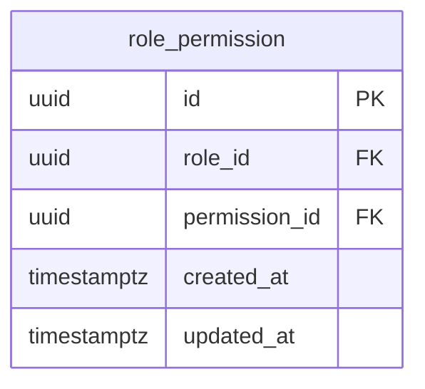
```mermaid
erDiagram
    role_permission {
        uuid id PK
        uuid role_id FK
        uuid permission_id FK
        timestamptz created_at
        timestamptz updated_at
    }
```

***

## 9.5 `user_role`

**表说明**：用户账号与角色关联表。

### 字段定义

| 字段名               | 类型   | 必填 | 说明      |
| ----------------- | ---- | -- | ------- |
| user\_account\_id | uuid | 是  | 用户账号 ID |
| role\_id          | uuid | 是  | 角色 ID   |

### 本表约束

- 唯一：`(user_account_id, role_id)`

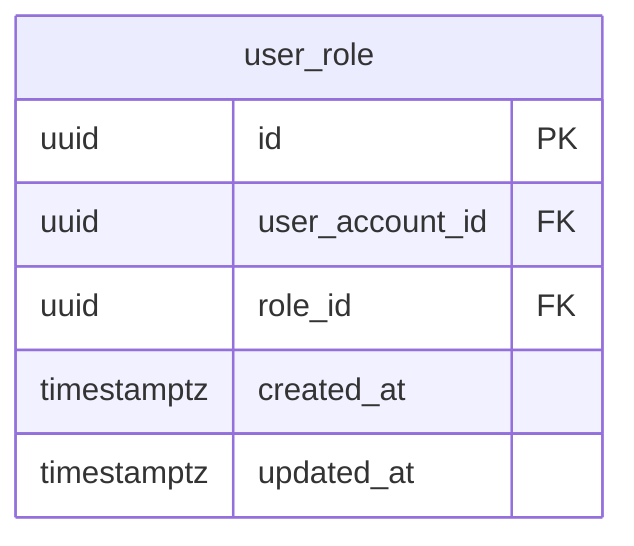
```mermaid
erDiagram
    user_role {
        uuid id PK
        uuid user_account_id FK
        uuid role_id FK
        timestamptz created_at
        timestamptz updated_at
    }
```

***

## 9.6 `dict_type`

**表说明**：字典类型表。

### 字段定义

| 字段名           | 类型           | 必填 | 说明      |
| ------------- | ------------ | -- | ------- |
| type\_code    | varchar(50)  | 是  | 字典类型编码  |
| type\_name    | varchar(100) | 是  | 字典类型名称  |
| description   | text         | 否  | 说明      |
| sort\_order   | int          | 是  | 排序号     |
| is\_enabled   | boolean      | 是  | 是否启用    |
| extra\_config | jsonb        | 否  | 类型级扩展配置 |

### 本表约束

- 唯一：`type_code`

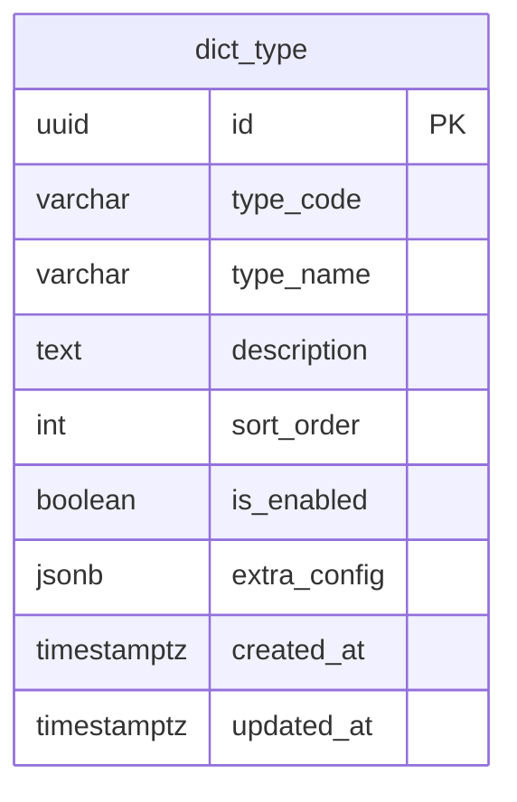
```mermaid
erDiagram
    dict_type {
        uuid id PK
        varchar type_code
        varchar type_name
        text description
        int sort_order
        boolean is_enabled
        jsonb extra_config
        timestamptz created_at
        timestamptz updated_at
    }
```

***

## 9.7 `dict_item`

**表说明**：字典项表。

### 字段定义

| 字段名            | 类型           | 必填 | 说明     |
| -------------- | ------------ | -- | ------ |
| dict\_type\_id | uuid         | 是  | 所属字典类型 |
| item\_code     | varchar(50)  | 是  | 字典项编码  |
| item\_name     | varchar(100) | 是  | 字典项名称  |
| description    | text         | 否  | 说明     |
| sort\_order    | int          | 是  | 排序号    |
| is\_enabled    | boolean      | 是  | 是否启用   |
| extra\_config  | jsonb        | 否  | 扩展配置   |

### 本表约束

- 唯一：`(dict_type_id, item_code)`
- 索引：`(dict_type_id, is_enabled, sort_order)`

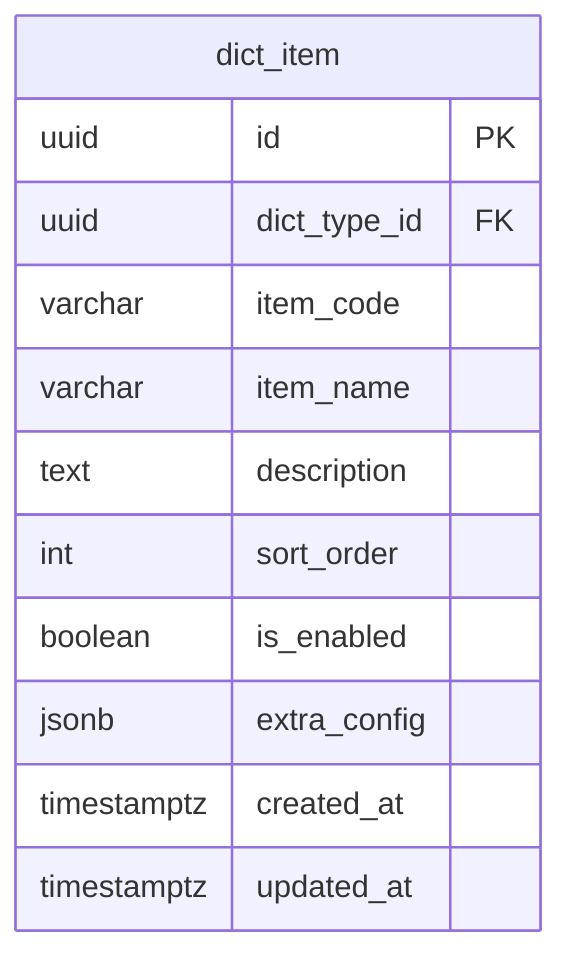
```mermaid
erDiagram
    dict_item {
        uuid id PK
        uuid dict_type_id FK
        varchar item_code
        varchar item_name
        text description
        int sort_order
        boolean is_enabled
        jsonb extra_config
        timestamptz created_at
        timestamptz updated_at
    }
```

***

## 9.8 `scene`

**表说明**：实际作业场景或采集地点。

### 字段定义

| 字段名             | 类型           | 必填 | 说明   |
| --------------- | ------------ | -- | ---- |
| scene\_code     | varchar(50)  | 否  | 场景编码 |
| scene\_name     | varchar(100) | 是  | 场景名称 |
| scene\_location | varchar(200) | 是  | 场景地点 |
| description     | text         | 否  | 场景说明 |
| is\_enabled     | boolean      | 是  | 是否启用 |

### 本表约束

- 唯一：`scene_code`（非空）

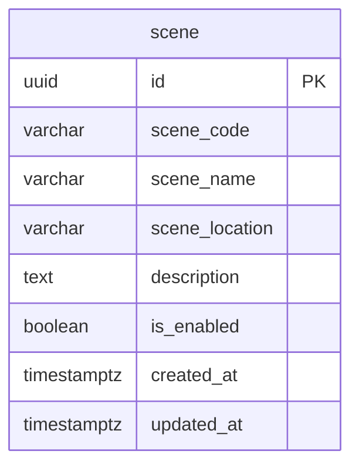
```mermaid
erDiagram
    scene {
        uuid id PK
        varchar scene_code
        varchar scene_name
        varchar scene_location
        text description
        boolean is_enabled
        timestamptz created_at
        timestamptz updated_at
    }
```

***

## 9.9 `department`

**表说明**：部门主数据。

### 字段定义

| 字段名                   | 类型           | 必填 | 说明         |
| --------------------- | ------------ | -- | ---------- |
| department\_code      | varchar(50)  | 否  | 部门编码       |
| department\_name      | varchar(100) | 是  | 部门名称       |
| manager\_employee\_id | uuid         | 否  | 部门负责人员工 ID |
| is\_enabled           | boolean      | 是  | 是否启用       |

### 本表约束

- 唯一：`department_code`（非空）

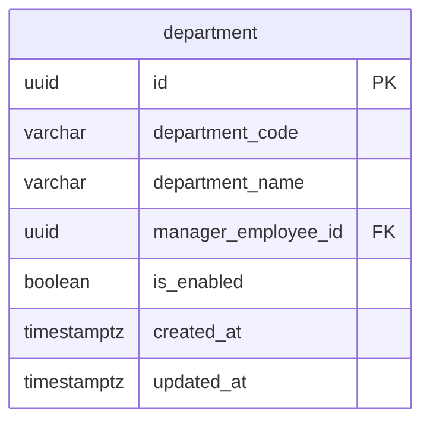
```mermaid
erDiagram
    department {
        uuid id PK
        varchar department_code
        varchar department_name
        uuid manager_employee_id FK
        boolean is_enabled
        timestamptz created_at
        timestamptz updated_at
    }
```

***

## 9.10 `channel`

**表说明**：人员来源渠道。

### 字段定义

| 字段名                           | 类型           | 必填 | 说明      |
| ----------------------------- | ------------ | -- | ------- |
| channel\_code                 | varchar(50)  | 否  | 渠道编码    |
| channel\_name                 | varchar(100) | 是  | 渠道名称    |
| channel\_type\_dict\_item\_id | uuid         | 是  | 渠道类型字典项 |
| contact\_person               | varchar(50)  | 否  | 联系人     |
| contact\_phone                | varchar(50)  | 否  | 联系方式    |
| cooperation\_description      | text         | 否  | 合作说明    |
| is\_enabled                   | boolean      | 是  | 是否启用    |

### 本表约束

- 唯一：`channel_code`（非空）

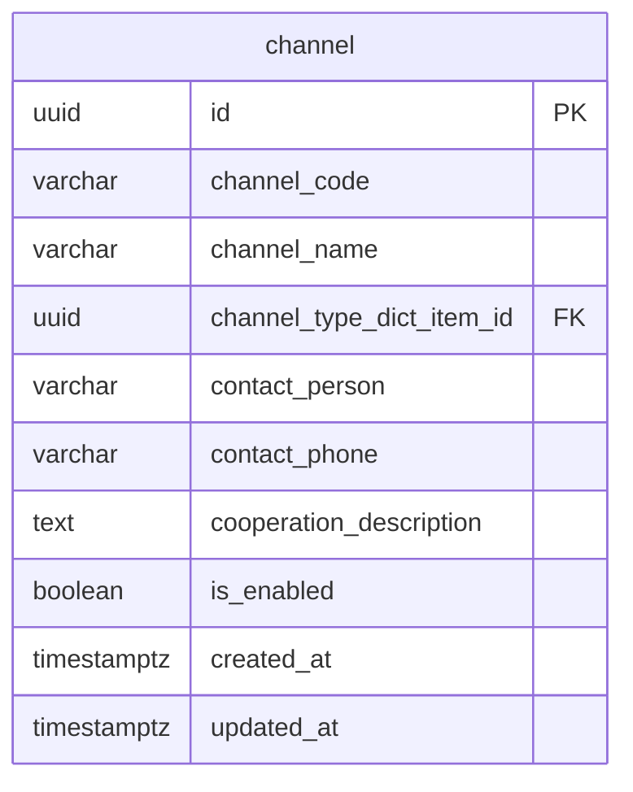
```mermaid
erDiagram
    channel {
        uuid id PK
        varchar channel_code
        varchar channel_name
        uuid channel_type_dict_item_id FK
        varchar contact_person
        varchar contact_phone
        text cooperation_description
        boolean is_enabled
        timestamptz created_at
        timestamptz updated_at
    }
```

***

## 9.11 `employee`

**表说明**：员工主数据，排班主体。

### 字段定义

| 字段名                              | 类型          | 必填 | 说明               |
| -------------------------------- | ----------- | -- | ---------------- |
| employee\_no                     | varchar(50) | 是  | 工号               |
| full\_name                       | varchar(50) | 是  | 姓名，Excel 通过该字段匹配 |
| mobile\_number                   | varchar(20) | 是  | 手机号              |
| channel\_id                      | uuid        | 是  | 来源渠道             |
| department\_id                   | uuid        | 是  | 所属部门             |
| onboard\_date                    | date        | 是  | 入职/到岗日期          |
| employee\_status\_dict\_item\_id | uuid        | 是  | 员工状态字典项          |
| remark                           | text        | 否  | 备注               |

### 本表约束

- 唯一：`employee_no`
- 唯一：`(mobile_number, channel_id)`
- 索引：`(department_id, employee_status_dict_item_id)`
- 索引：`(channel_id, employee_status_dict_item_id)`
- 索引：`(full_name)`

> 说明：\
> `full_name` 不做唯一约束。\
> Excel 导入时的“姓名唯一匹配”由导入逻辑保证。

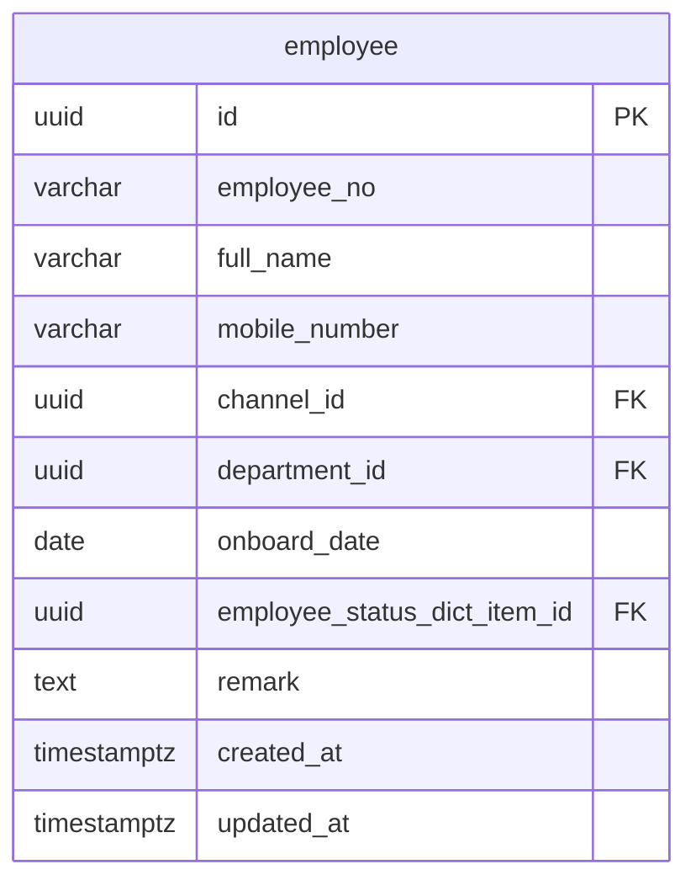
```mermaid
erDiagram
    employee {
        uuid id PK
        varchar employee_no
        varchar full_name
        varchar mobile_number
        uuid channel_id FK
        uuid department_id FK
        date onboard_date
        uuid employee_status_dict_item_id FK
        text remark
        timestamptz created_at
        timestamptz updated_at
    }
```

***

## 9.12 `skill`

**表说明**：技能主数据。

### 字段定义

| 字段名         | 类型           | 必填 | 说明   |
| ----------- | ------------ | -- | ---- |
| skill\_code | varchar(50)  | 是  | 技能编码 |
| skill\_name | varchar(100) | 是  | 技能名称 |
| is\_enabled | boolean      | 是  | 是否启用 |
| description | text         | 否  | 描述   |

### 本表约束

- 唯一：`skill_code`

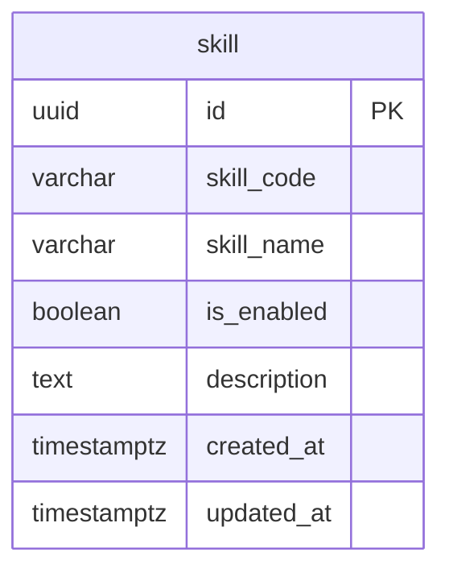
```mermaid
erDiagram
    skill {
        uuid id PK
        varchar skill_code
        varchar skill_name
        boolean is_enabled
        text description
        timestamptz created_at
        timestamptz updated_at
    }
```

***

## 9.13 `employee_skill`

**表说明**：员工技能关联表，直接保存技能级别与效率系数。

### 字段定义

| 字段名                     | 类型           | 必填 | 说明             |
| ----------------------- | ------------ | -- | -------------- |
| employee\_id            | uuid         | 是  | 员工 ID          |
| skill\_id               | uuid         | 是  | 技能 ID          |
| skill\_level            | smallint     | 是  | 1=初级，2=中级，3=高级 |
| efficiency\_coefficient | numeric(5,2) | 是  | 效率系数           |
| is\_primary             | boolean      | 是  | 是否主技能          |
| certified\_at           | date         | 否  | 认证日期           |
| is\_enabled             | boolean      | 是  | 是否启用           |
| remark                  | text         | 否  | 备注             |

### 本表约束

- 唯一：`(employee_id, skill_id)`
- 建议唯一：`(employee_id)` where `is_primary = true and is_enabled = true`
- 检查：`skill_level IN (1,2,3)`
- 检查：`efficiency_coefficient > 0`
- 索引：`(skill_id, is_enabled)`

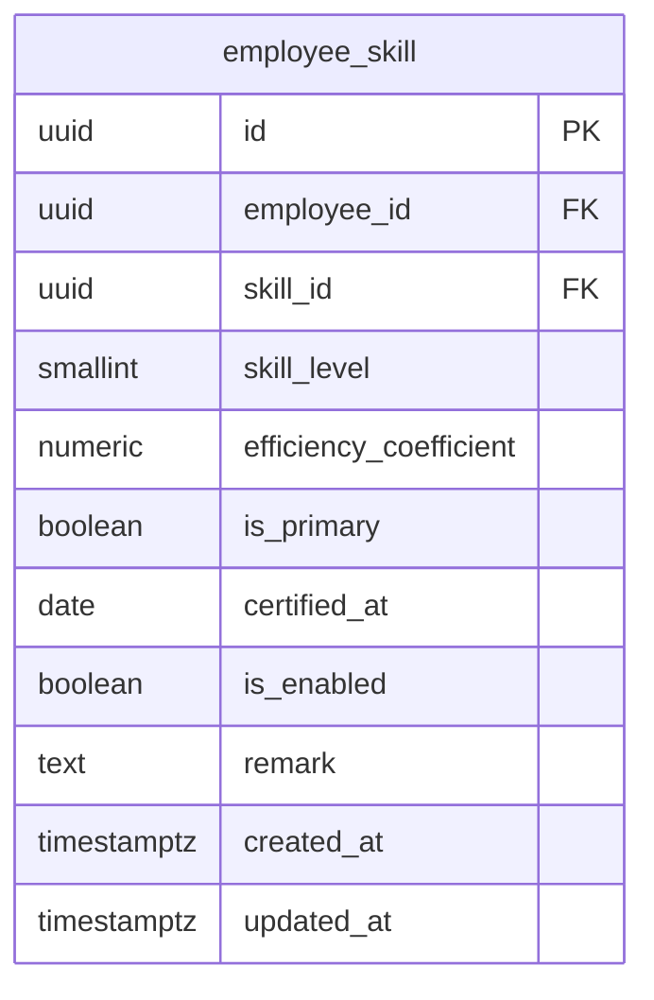
```mermaid
erDiagram
    employee_skill {
        uuid id PK
        uuid employee_id FK
        uuid skill_id FK
        smallint skill_level
        numeric efficiency_coefficient
        boolean is_primary
        date certified_at
        boolean is_enabled
        text remark
        timestamptz created_at
        timestamptz updated_at
    }
```

***

## 9.14 `labor_rule`

**表说明**：用工规则配置表，用于排班校验。

### 字段定义

| 字段名                          | 类型           | 必填 | 说明         |
| ---------------------------- | ------------ | -- | ---------- |
| rule\_name                   | varchar(100) | 是  | 规则名称       |
| applicable\_scope            | jsonb        | 是  | 适用范围       |
| priority                     | int          | 是  | 优先级，值越小越优先 |
| daily\_hours\_limit          | numeric(4,2) | 是  | 日工时上限      |
| weekly\_hours\_limit         | numeric(5,2) | 是  | 周工时上限      |
| max\_consecutive\_work\_days | int          | 是  | 连续工作天数上限   |
| is\_hard\_constraint         | boolean      | 是  | 是否硬约束      |
| is\_enabled                  | boolean      | 是  | 是否启用       |
| remark                       | text         | 否  | 备注         |

### 本表约束

- 检查：`daily_hours_limit >= 0`
- 检查：`weekly_hours_limit >= 0`
- 检查：`max_consecutive_work_days >= 0`
- 建议索引：`(is_enabled, priority)`

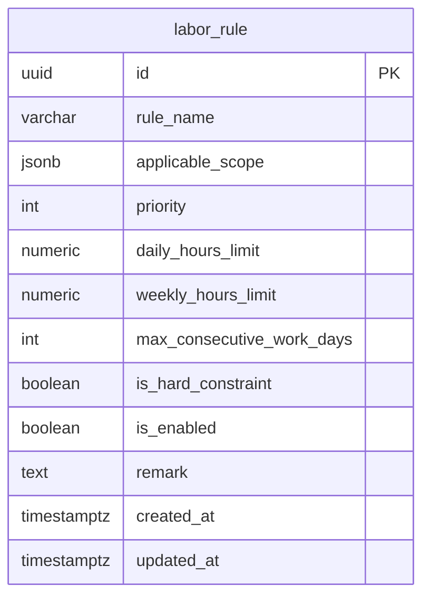
```mermaid
erDiagram
    labor_rule {
        uuid id PK
        varchar rule_name
        jsonb applicable_scope
        int priority
        numeric daily_hours_limit
        numeric weekly_hours_limit
        int max_consecutive_work_days
        boolean is_hard_constraint
        boolean is_enabled
        text remark
        timestamptz created_at
        timestamptz updated_at
    }
```

***

## 9.15 `project`

**表说明**：项目主数据，排班一级业务容器。

### 字段定义

| 字段名                             | 类型           | 必填 | 说明                           |
| ------------------------------- | ------------ | -- | ---------------------------- |
| project\_code                   | varchar(50)  | 否  | 项目编码                         |
| project\_name                   | varchar(100) | 是  | 项目名称                         |
| scene\_id                       | uuid         | 是  | 关联场景                         |
| project\_mode                   | varchar(30)  | 是  | `self_built / non_intrusive` |
| start\_date                     | date         | 是  | 开始日期                         |
| end\_date                       | date         | 是  | 结束日期                         |
| owner\_employee\_id             | uuid         | 否  | 负责人员工 ID                     |
| project\_status\_dict\_item\_id | uuid         | 是  | 项目状态字典项                      |
| remark                          | text         | 否  | 备注                           |

### 本表约束

- 唯一：`project_code`（非空）
- 检查：`project_mode IN ('self_built','non_intrusive')`
- 检查：`start_date <= end_date`
- 索引：`(scene_id, project_status_dict_item_id)`

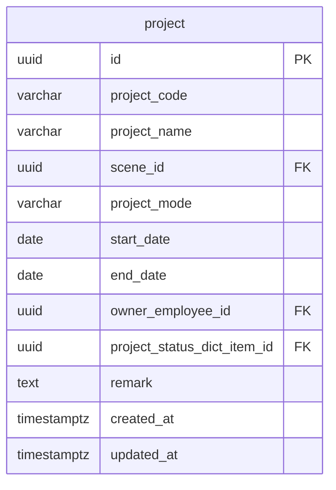
```mermaid
erDiagram
    project {
        uuid id PK
        varchar project_code
        varchar project_name
        uuid scene_id FK
        varchar project_mode
        date start_date
        date end_date
        uuid owner_employee_id FK
        uuid project_status_dict_item_id FK
        text remark
        timestamptz created_at
        timestamptz updated_at
    }
```

***

## 9.16 `task`

**表说明**：项目下的任务。

### 字段定义

| 字段名                          | 类型           | 必填 | 说明           |
| ---------------------------- | ------------ | -- | ------------ |
| task\_code                   | varchar(50)  | 否  | 任务编码，建议项目内唯一 |
| project\_id                  | uuid         | 是  | 所属项目         |
| task\_name                   | varchar(100) | 是  | 任务名称         |
| target\_total\_hours         | numeric(8,2) | 是  | 目标总工时        |
| hours\_per\_shift            | numeric(5,2) | 是  | 单次工时         |
| target\_efficiency\_rate     | numeric(4,2) | 否  | 有效率要求        |
| planned\_start\_date         | date         | 是  | 计划开始日期       |
| planned\_end\_date           | date         | 是  | 计划结束日期       |
| task\_status\_dict\_item\_id | uuid         | 是  | 任务状态字典项      |
| remark                       | text         | 否  | 备注           |

### 本表约束

- 建议唯一：`(project_id, task_code)`（`task_code` 非空）
- 检查：`target_total_hours >= 0`
- 检查：`hours_per_shift >= 0`
- 检查：`planned_start_date <= planned_end_date`
- 建议检查：`target_efficiency_rate BETWEEN 0 AND 1`
- 索引：`(project_id, task_status_dict_item_id)`

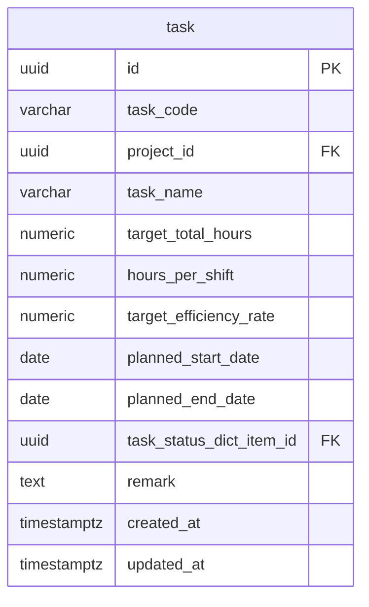
```mermaid
erDiagram
    task {
        uuid id PK
        varchar task_code
        uuid project_id FK
        varchar task_name
        numeric target_total_hours
        numeric hours_per_shift
        numeric target_efficiency_rate
        date planned_start_date
        date planned_end_date
        uuid task_status_dict_item_id FK
        text remark
        timestamptz created_at
        timestamptz updated_at
    }
```

***

## 9.17 `device`

**表说明**：场景下的设备资源，每个设备绑定一个技能。

### 字段定义

| 字段名                            | 类型           | 必填 | 说明      |
| ------------------------------ | ------------ | -- | ------- |
| scene\_id                      | uuid         | 是  | 所属场景    |
| device\_code                   | varchar(50)  | 是  | 设备编号    |
| device\_name                   | varchar(100) | 是  | 设备名称    |
| skill\_id                      | uuid         | 是  | 绑定技能    |
| device\_status\_dict\_item\_id | uuid         | 是  | 设备状态字典项 |
| remark                         | text         | 否  | 备注      |

### 本表约束

- 唯一：`device_code`
- 索引：`(scene_id, device_status_dict_item_id)`
- 索引：`(skill_id)`

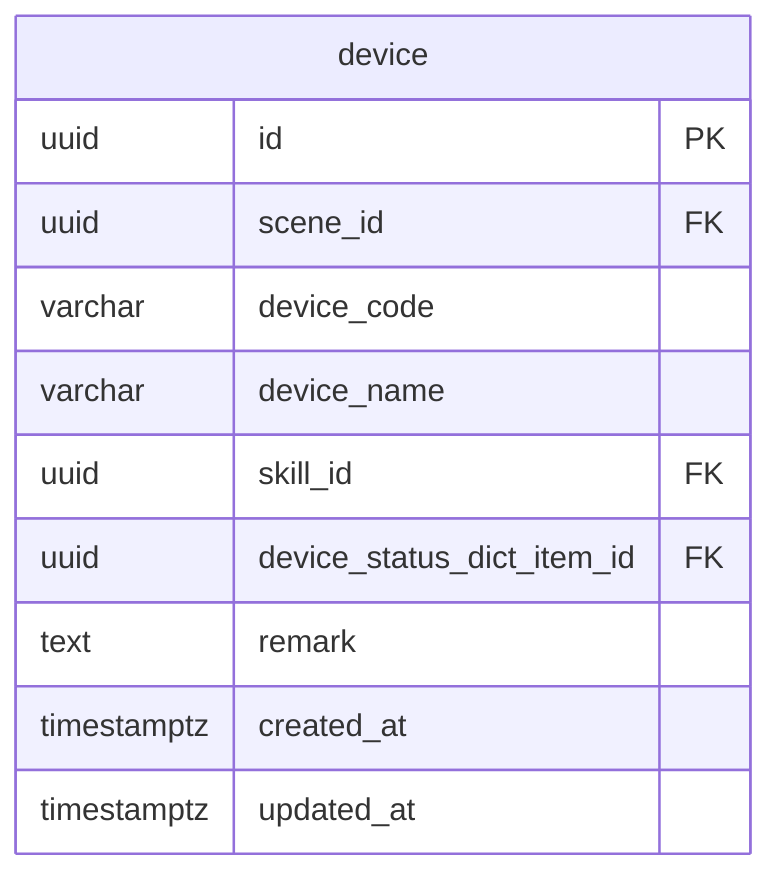
```mermaid
erDiagram
    device {
        uuid id PK
        uuid scene_id FK
        varchar device_code
        varchar device_name
        uuid skill_id FK
        uuid device_status_dict_item_id FK
        text remark
        timestamptz created_at
        timestamptz updated_at
    }
```

***

## 9.18 `task_device`

**表说明**：任务与设备绑定关系表。

### 字段定义

| 字段名         | 类型           | 必填 | 说明    |
| ----------- | ------------ | -- | ----- |
| task\_id    | uuid         | 是  | 任务 ID |
| device\_id  | uuid         | 是  | 设备 ID |
| sort\_order | int          | 否  | 排序号   |
| remark      | varchar(255) | 否  | 备注    |

### 本表约束

- 唯一：`(task_id, device_id)`
- 建议检查：`sort_order >= 0`

> 跨表规则：\
> `device_id` 必须来自 `task.project_id -> project.scene_id` 对应场景。

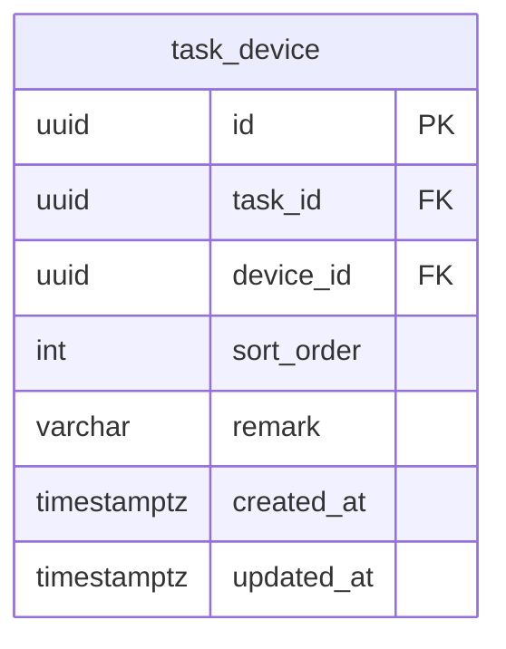
```mermaid
erDiagram
    task_device {
        uuid id PK
        uuid task_id FK
        uuid device_id FK
        int sort_order
        varchar remark
        timestamptz created_at
        timestamptz updated_at
    }
```

***

## 9.19 `shift_template`

**表说明**：排班模板表，仅用于批量生成，不代表智能排班。

### 字段定义

| 字段名                        | 类型           | 必填 | 说明   |
| -------------------------- | ------------ | -- | ---- |
| template\_name             | varchar(100) | 是  | 模板名称 |
| template\_content          | jsonb        | 是  | 模板内容 |
| applicable\_task\_id       | uuid         | 否  | 适用任务 |
| applicable\_department\_id | uuid         | 否  | 适用部门 |
| description                | text         | 否  | 模板说明 |
| is\_enabled                | boolean      | 是  | 是否启用 |

### 本表约束

- 索引：`(applicable_task_id, applicable_department_id, is_enabled)`

### `template_content` 建议结构

```json
{
  "days": {
    "1": { "shift_type_item_code": "day_shift", "schedule_code_item_code": "work_a" },
    "2": { "shift_type_item_code": "rest_shift", "schedule_code_item_code": "rest" }
  }
}
```

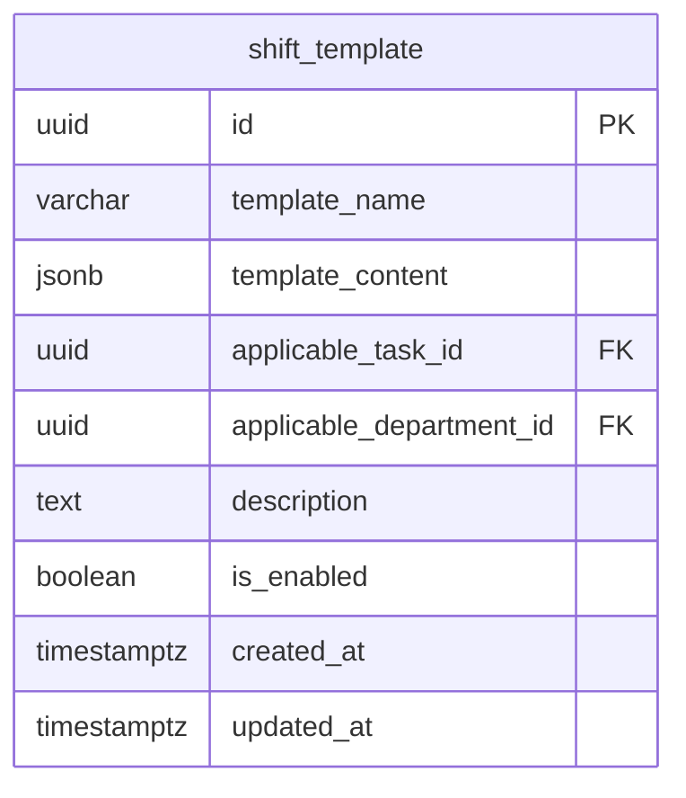
```mermaid
erDiagram
    shift_template {
        uuid id PK
        varchar template_name
        jsonb template_content
        uuid applicable_task_id FK
        uuid applicable_department_id FK
        text description
        boolean is_enabled
        timestamptz created_at
        timestamptz updated_at
    }
```

***

## 9.20 `schedule_version`

**表说明**：按项目 + 月份管理的排班版本表。

### 字段定义

| 字段名                              | 类型          | 必填 | 说明                          |
| -------------------------------- | ----------- | -- | --------------------------- |
| project\_id                      | uuid        | 是  | 所属项目                        |
| schedule\_month                  | date        | 是  | 排班月份，统一存当月第一天               |
| version\_no                      | int         | 是  | 版本号                         |
| publish\_status\_dict\_item\_id  | uuid        | 是  | 发布状态字典项                     |
| generation\_type                 | varchar(20) | 是  | `manual / template / excel` |
| created\_by\_user\_account\_id   | uuid        | 是  | 创建人账号 ID                    |
| published\_at                    | timestamptz | 否  | 发布时间                        |
| published\_by\_user\_account\_id | uuid        | 否  | 发布人账号 ID                    |
| remark                           | text        | 否  | 备注                          |

### 本表约束

- 唯一：`(project_id, schedule_month, version_no)`
- 检查：`generation_type IN ('manual','template','excel')`
- 检查：`schedule_month = date_trunc('month', schedule_month)::date`
- 建议检查：`version_no >= 1`
- 索引：`(project_id, schedule_month, publish_status_dict_item_id)`

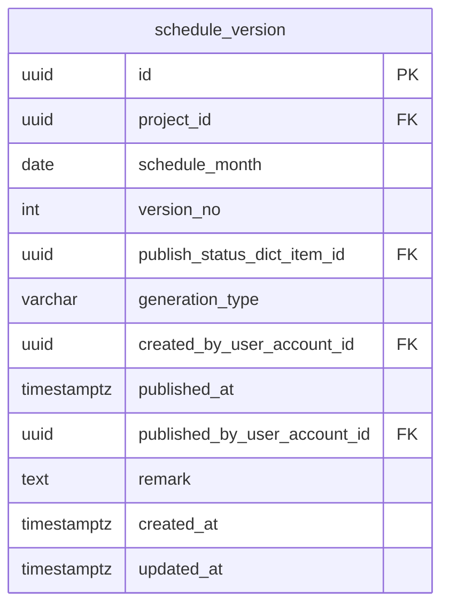
```mermaid
erDiagram
    schedule_version {
        uuid id PK
        uuid project_id FK
        date schedule_month
        int version_no
        uuid publish_status_dict_item_id FK
        varchar generation_type
        uuid created_by_user_account_id FK
        timestamptz published_at
        uuid published_by_user_account_id FK
        text remark
        timestamptz created_at
        timestamptz updated_at
    }
```

***

## 9.21 `schedule_import_batch`

**表说明**：Excel 导入批次追溯表。

### 字段定义

| 字段名                             | 类型          | 必填 | 说明                           |
| ------------------------------- | ----------- | -- | ---------------------------- |
| project\_id                     | uuid        | 是  | 项目 ID                        |
| schedule\_month                 | date        | 是  | 排班月份，统一存当月第一天                |
| schedule\_version\_id           | uuid        | 否  | 生成的排班版本 ID                   |
| original\_file\_url             | text        | 是  | 原始文件地址                       |
| import\_mode                    | varchar(20) | 是  | `cover_draft / new_version`  |
| processing\_status              | varchar(20) | 是  | `pending / success / failed` |
| total\_row\_count               | int         | 是  | 总员工行数                        |
| success\_row\_count             | int         | 是  | 成功员工行数                       |
| failed\_row\_count              | int         | 是  | 失败员工行数                       |
| error\_report\_url              | text        | 否  | 错误报告地址                       |
| imported\_by\_user\_account\_id | uuid        | 是  | 导入人账号 ID                     |
| completed\_at                   | timestamptz | 否  | 处理完成时间                       |

### 本表约束

- 检查：`import_mode IN ('cover_draft','new_version')`
- 检查：`processing_status IN ('pending','success','failed')`
- 检查：`schedule_month = date_trunc('month', schedule_month)::date`
- 检查：`total_row_count >= 0`
- 检查：`success_row_count >= 0`
- 检查：`failed_row_count >= 0`
- 检查：`success_row_count + failed_row_count <= total_row_count`
- 索引：`(project_id, schedule_month, processing_status, created_at)`

```mermaid
erDiagram
    schedule_import_batch {
        uuid id PK
        uuid project_id FK
        date schedule_month
        uuid schedule_version_id FK
        text original_file_url
        varchar import_mode
        varchar processing_status
        int total_row_count
        int success_row_count
        int failed_row_count
        text error_report_url
        uuid imported_by_user_account_id FK
        timestamptz completed_at
        timestamptz created_at
        timestamptz updated_at
    }
```

***

## 9.22 `schedule`

**表说明**：排班明细表，系统核心业务表。

### 字段定义

| 字段名                               | 类型           | 必填 | 说明                          |
| --------------------------------- | ------------ | -- | --------------------------- |
| schedule\_version\_id             | uuid         | 是  | 所属排班版本                      |
| employee\_id                      | uuid         | 是  | 排班员工                        |
| department\_id                    | uuid         | 是  | 员工所属部门快照                    |
| project\_id                       | uuid         | 是  | 所属项目                        |
| task\_id                          | uuid         | 否  | 所属任务，可为空                    |
| device\_id                        | uuid         | 否  | 设备，可为空                      |
| schedule\_date                    | date         | 是  | 排班日期                        |
| shift\_type\_dict\_item\_id       | uuid         | 是  | 班次类型字典项                     |
| schedule\_code\_dict\_item\_id    | uuid         | 是  | 排班编码字典项                     |
| planned\_hours                    | numeric(5,2) | 是  | 计划工时                        |
| skill\_id\_snapshot               | uuid         | 否  | 技能快照                        |
| skill\_level\_snapshot            | smallint     | 否  | 技能级别快照                      |
| efficiency\_coefficient\_snapshot | numeric(5,2) | 否  | 效率系数快照                      |
| source\_type                      | varchar(20)  | 是  | `manual / template / excel` |
| schedule\_import\_batch\_id       | uuid         | 否  | Excel 导入批次 ID               |
| remark                            | varchar(255) | 否  | 备注                          |

### 本表约束

- 唯一：`(schedule_version_id, employee_id, schedule_date)`
- 建议唯一：`(schedule_version_id, device_id, schedule_date, shift_type_dict_item_id)` where `device_id is not null`
- 检查：`planned_hours >= 0`
- 检查：`skill_level_snapshot IN (1,2,3) OR skill_level_snapshot IS NULL`
- 检查：`source_type IN ('manual','template','excel')`
- 检查：`task_id IS NOT NULL OR device_id IS NULL`
- 索引：`(employee_id, schedule_date)`
- 索引：`(project_id, schedule_date)`
- 索引：`(task_id, schedule_date)`
- 索引：`(device_id, schedule_date)`
- 索引：`(schedule_version_id, schedule_date)`
- 索引：`(schedule_import_batch_id)`

### 关键跨表规则

- `project_id` 必须等于 `schedule_version.project_id`
- `task_id` 非空时，`task.project_id` 必须等于 `project_id`
- `device_id` 非空时，设备必须属于项目场景
- `device_id` 非空时，必须存在 `task_device(task_id, device_id)`
- `device_id` 非空时，员工必须具备 `device.skill_id`
- Excel 基础导入允许 `task_id / device_id / skill_*_snapshot` 为空

```mermaid
erDiagram
    schedule {
        uuid id PK
        uuid schedule_version_id FK
        uuid employee_id FK
        uuid department_id FK
        uuid project_id FK
        uuid task_id FK
        uuid device_id FK
        date schedule_date
        uuid shift_type_dict_item_id FK
        uuid schedule_code_dict_item_id FK
        numeric planned_hours
        uuid skill_id_snapshot FK
        smallint skill_level_snapshot
        numeric efficiency_coefficient_snapshot
        varchar source_type
        uuid schedule_import_batch_id FK
        varchar remark
        timestamptz created_at
        timestamptz updated_at
    }
```

***

## 9.23 `shift_change_request`

**表说明**：调班申请与审批表。

### 字段定义

| 字段名                                    | 类型           | 必填 | 说明                     |
| -------------------------------------- | ------------ | -- | ---------------------- |
| request\_type                          | varchar(20)  | 是  | `swap / direct_change` |
| applicant\_employee\_id                | uuid         | 是  | 申请员工                   |
| target\_employee\_id                   | uuid         | 否  | 目标员工，互换时使用             |
| original\_schedule\_id                 | uuid         | 是  | 原排班记录                  |
| target\_schedule\_id                   | uuid         | 否  | 目标排班记录，互换时使用           |
| target\_date                           | date         | 否  | 目标日期                   |
| target\_shift\_type\_dict\_item\_id    | uuid         | 否  | 目标班次类型                 |
| target\_schedule\_code\_dict\_item\_id | uuid         | 否  | 目标排班编码                 |
| target\_task\_id                       | uuid         | 否  | 目标任务                   |
| target\_device\_id                     | uuid         | 否  | 目标设备                   |
| reason                                 | varchar(255) | 是  | 申请原因                   |
| approval\_status\_dict\_item\_id       | uuid         | 是  | 审批状态                   |
| approver\_user\_account\_id            | uuid         | 否  | 审批人                    |
| approved\_at                           | timestamptz  | 否  | 审批时间                   |
| approval\_comment                      | varchar(255) | 否  | 审批意见                   |

### 本表约束

- 检查：`request_type IN ('swap','direct_change')`
- 索引：`(applicant_employee_id, approval_status_dict_item_id, created_at)`
- 索引：`(target_employee_id, approval_status_dict_item_id)`
- 索引：`(original_schedule_id)`

### 字段组合规则

- 当 `request_type = 'swap'`：
  - `target_employee_id` 必填
  - `target_schedule_id` 必填
- 当 `request_type = 'direct_change'`：
  - `target_date` 必填
  - `target_shift_type_dict_item_id` 必填
  - `target_schedule_code_dict_item_id` 必填

```mermaid
erDiagram
    shift_change_request {
        uuid id PK
        varchar request_type
        uuid applicant_employee_id FK
        uuid target_employee_id FK
        uuid original_schedule_id FK
        uuid target_schedule_id FK
        date target_date
        uuid target_shift_type_dict_item_id FK
        uuid target_schedule_code_dict_item_id FK
        uuid target_task_id FK
        uuid target_device_id FK
        varchar reason
        uuid approval_status_dict_item_id FK
        uuid approver_user_account_id FK
        timestamptz approved_at
        varchar approval_comment
        timestamptz created_at
        timestamptz updated_at
    }
```

***

## 9.24 `employee_work_metric`

**表说明**：员工工时画像表，存当前统计快照。

### 字段定义

| 字段名                     | 类型           | 必填 | 说明           |
| ----------------------- | ------------ | -- | ------------ |
| employee\_id            | uuid         | 是  | 员工 ID        |
| avg\_daily\_hours\_7d   | numeric(5,2) | 是  | 近 7 日平均日工时   |
| avg\_daily\_hours\_30d  | numeric(5,2) | 是  | 近 30 日平均日工时  |
| avg\_shift\_hours\_30d  | numeric(5,2) | 是  | 近 30 日平均单次工时 |
| avg\_weekly\_hours\_30d | numeric(6,2) | 是  | 近 30 日平均周工时  |
| total\_hours            | numeric(8,2) | 是  | 累计工时         |
| calculated\_at          | timestamptz  | 是  | 统计计算时间       |

### 本表约束

- 唯一：`employee_id`
- 检查：所有数值字段 `>= 0`
- 索引：`(calculated_at)`

```mermaid
erDiagram
    employee_work_metric {
        uuid id PK
        uuid employee_id FK
        numeric avg_daily_hours_7d
        numeric avg_daily_hours_30d
        numeric avg_shift_hours_30d
        numeric avg_weekly_hours_30d
        numeric total_hours
        timestamptz calculated_at
        timestamptz created_at
        timestamptz updated_at
    }
```

***

## 9.25 `announcement`

**表说明**：公告表。

### 字段定义

| 字段名                                | 类型           | 必填 | 说明                                 |
| ---------------------------------- | ------------ | -- | ---------------------------------- |
| title                              | varchar(200) | 是  | 公告标题                               |
| announcement\_type\_dict\_item\_id | uuid         | 是  | 公告类型字典项                            |
| content                            | text         | 是  | 公告正文                               |
| visibility\_scope\_type            | varchar(20)  | 是  | `all / role / department / custom` |
| visibility\_scope\_config          | jsonb        | 否  | 可见范围配置                             |
| published\_by\_user\_account\_id   | uuid         | 是  | 发布人                                |
| published\_at                      | timestamptz  | 是  | 发布时间                               |

### 本表约束

- 检查：`visibility_scope_type IN ('all','role','department','custom')`
- 索引：`(published_at DESC)`
- 索引：`(announcement_type_dict_item_id, published_at DESC)`

### `visibility_scope_config` 示例

```json
{
  "role_codes": ["admin", "department_manager"],
  "department_ids": ["uuid-1", "uuid-2"],
  "employee_ids": []
}
```

```mermaid
erDiagram
    announcement {
        uuid id PK
        varchar title
        uuid announcement_type_dict_item_id FK
        text content
        varchar visibility_scope_type
        jsonb visibility_scope_config
        uuid published_by_user_account_id FK
        timestamptz published_at
        timestamptz created_at
        timestamptz updated_at
    }
```

***

# 10. 推荐建表顺序

为减少循环依赖问题，建议建表顺序如下：

1. `dict_type`
2. `dict_item`
3. `scene`
4. `department`（先不加 `manager_employee_id` FK 或允许为空）
5. `channel`
6. `skill`
7. `employee`
8. `user_account`
9. `role`
10. `permission`
11. `role_permission`
12. `user_role`
13. `labor_rule`
14. `project`
15. `task`
16. `device`
17. `task_device`
18. `shift_template`
19. `schedule_version`
20. `schedule_import_batch`
21. `schedule`
22. `shift_change_request`
23. `employee_work_metric`
24. `announcement`
